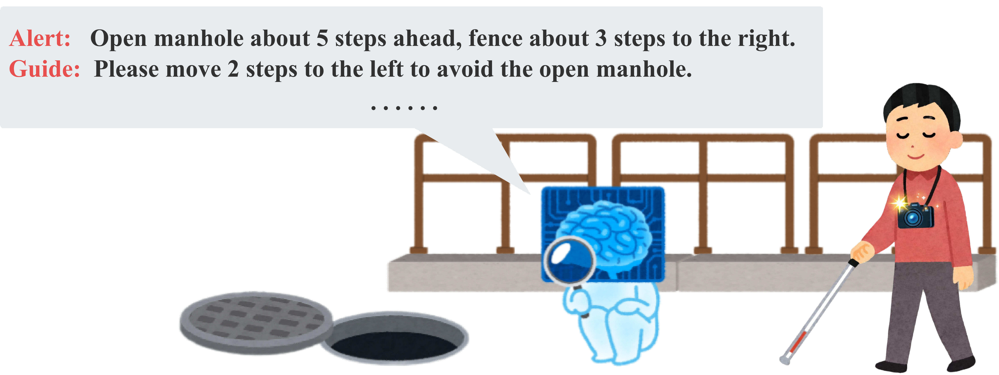

# Hazard-Aware Guidance (HAG) Dataset

Code and supporting materials for **MLLM-Assisted Dataset Construction for Hazard-Aware Guidance for Individuals with Visual Impairments**.

The study combines real-world outdoor images and Unity-based synthetic images to construct hazard-aware guidance annotations and fine-tune Qwen2.5-VL models. The output format separates hazard alerts (`ALERT`) from avoidance guidance (`GUIDE`), with `<SAFE/>` for predicted-safe scenes.

## Resources

- [HAG-Qwen2.5-VL-7B-RU model and LoRA adapter](https://huggingface.co/xcyuan/HAG-Qwen2.5-VL-7B-RU)
- [Planned dataset release](https://huggingface.co/datasets/xcyuan/Hazard-Aware-Guidance-HAG_Dataset)
- Reserved identifier for the planned data release: `10.5281/zenodo.22844198`.

Code is provided here; model weights are hosted separately. The dataset package is planned for release after acceptance, subject to licensing and privacy constraints. Planned materials include Unity images and annotations, structured annotations, reviewed evaluation labels, and the 200 author-curated expert-derived exemplar annotations. Third-party real-world images will not be redistributed.

## Repository contents

| Directory | Contents |
| --- | --- |
| [Fine-tuning_data](Fine-tuning_data/README.md) | LLaMA-Factory training and adapter-merge configurations. |
| [scripts](scripts/README.md) | Annotation, inference, evaluation, and preprocessing code. |
| [Unity_scripts](Unity_scripts/README.md) | Image/SSI capture, hazard geometry, and scene animation helpers. |
| [results](results/README.md) | Selected aggregate experimental results. |
| [docs/huggingface_model_card](docs/huggingface_model_card/README.md) | English and Chinese model-card sources. |

## Additional experiments

| Experiment | Code | Results |
| --- | --- | --- |
| WAD comparison: object-level Hazard F1 and Category F1 | [Structured comparison](scripts/wad_structured_comparison/README.md) | [Results](results/wad_structured_comparison/README.md) |
| Automatic step estimates against manual references | [Distance check](scripts/automatic_step_distance_check/README.md) | [Results](results/automatic_step_distance_check/README.md) |
| Repeated 3B/7B workstation latency benchmark | [Latency benchmark](scripts/repeated_workstation_latency/README.md) | [Results](results/repeated_workstation_latency/README.md) |

The earlier WAD and latency directories are retained as historical materials. The additional-experiment directories contain the results used in the revised manuscript.

## Use

See each directory's README for required inputs and configuration. The repository does not include training images, model weights, or every intermediate evaluation artifact. Some original scripts require local paths to be configured before use.

The study evaluates static daytime outdoor images. These materials do not constitute a validated navigation system.

## Citation and licensing

Citation metadata will be added when available. The model-card directory contains the model's license file; it does not establish a repository-wide license for all code or third-party assets. Refer to the applicable license of each component.
